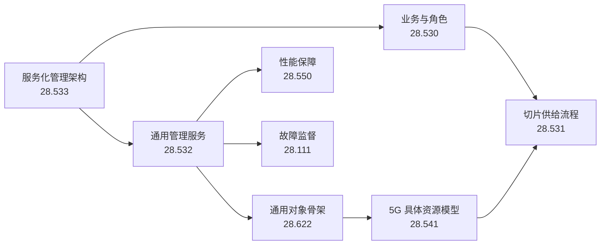

# 3GPP SA5 五类业务学习产出总览

> 基线：3GPP Release 18。本文档集用于建立学习框架和完成汇报，不替代规范的规范性条文。示例 URI、对象名和报文均需在实际项目中与所采用版本、厂商能力和 OpenAPI/YANG 文件再次核对。

## 先纠正两个容易混淆的定位

- **TS 28.530** 的正式定位是 *Concepts, use cases and requirements*，用于建立 5G 管理、网络切片、角色和生命周期的业务视图。
- **TS 28.531** 的正式定位是 *Provisioning*，不是架构规范。真正名为 *Architecture framework* 的规范是 [TS 28.533](./TS-28.533.md)，现已补入本套材料。
- **TS 28.622** 是通用 NRM 的 Stage 2 信息模型。它为配置、性能任务、订阅、文件等提供通用对象，但不是“只用于配置管理”的模型。5G 具体资源对象主要在 TS 28.541。

## 五类业务与规范映射

| 业务 | 第一主线 | 配套规范 | 学完应该能回答 |
|---|---|---|---|
| 配置管理 | [TS 28.532](./TS-28.532.md) | [TS 28.622](./TS-28.622.md)、[TS 28.541](./TS-28.541.md) | MOI 是什么；DN 如何定位对象；CRUD 如何映射到 REST/NETCONF；变更如何通知 |
| 性能管理 | [TS 28.550](./TS-28.550.md) | [TS 28.532](./TS-28.532.md)、[TS 28.622](./TS-28.622.md) | 测量任务如何创建；粒度周期与上报周期有何区别；文件、流、阈值三条链路如何协作 |
| 故障管理 | [TS 28.111](./TS-28.111.md) | [TS 28.532](./TS-28.532.md)、[TS 28.622](./TS-28.622.md) | 告警如何唯一识别；告警记录如何变化；通知丢失后如何同步；确认和清除有何区别 |
| 文件与数据上报 | [TS 28.532](./TS-28.532.md) | [TS 28.550](./TS-28.550.md)、[TS 28.622](./TS-28.622.md) | 为什么是“订阅/发现 + 文件就绪通知 + 客户端拉取”；文件元数据有哪些；支持哪些传输协议 |
| 网络资源与编排 | [TS 28.533](./TS-28.533.md) | [TS 28.530](./TS-28.530.md)、[TS 28.531](./TS-28.531.md)、[TS 28.541](./TS-28.541.md) | MnS 如何生产、消费和聚合；ServiceProfile 如何落到 NetworkSlice/NSSI/NF；生命周期流程如何衔接 |

## 推荐学习顺序

### 第 1 周：全局业务框架

先读 28.533，掌握 MnS、MnF、producer/consumer、A/B/C 组件和三种交互范式；再读 28.530，掌握角色、NetworkSlice/NetworkSliceSubnet、ServiceProfile/SliceProfile，以及准备、开通、运行、退网四阶段。

### 第 2 周：配置管理

先读 28.532 第 11.1、12.1 节，再用 28.622 理解通用对象树，最后用 28.541 的 `GnbDuFunction`、`NrCellDu` 或 `AmfFunction` 做一次具体 CRUD 演练。

### 第 3 周：性能与故障

用 28.550 建立测量任务、文件/流上报和阈值监控链路；用 28.111 建立告警记录、通知和同步链路。此时回看 28.532，会发现它提供的是两类业务共同使用的“接口积木”。

### 第 4 周：文件与接口

集中练习 28.532 的 REST OpenAPI、YANG/NETCONF 映射，以及 `notifyFileReady → 获取文件 → 校验/入库`。注意：规范允许 SFTP、FTPES、HTTPS，MnS producer 是文件服务器，consumer 主动拉取。

### 第 5 周：资源与编排

用 28.541 画出切片、子切片、网元/网络功能和端点关系；用 28.531 串起可行性检查、NSI/NSSI 分配、异步进度、激活、修改、去分配。

## 五个可验收的端到端练习

| 编号 | 练习 | 验收点 |
|---|---|---|
| CM-01 | 创建并修改一个 `NrCellDu` | 能写出父对象 DN、PUT/GET/PATCH/DELETE，能说明通知类型与回读校验 |
| PM-01 | 为两个 `NrCellDu` 创建 15 分钟粒度的测量任务 | 能解释 `iOCName`、`iOCInstanceList`、`measurementCategoryList`、`granularityPeriod`、`reportingPeriod` |
| FM-01 | 从新告警到确认、清除和告警表同步 | 能区分 `perceivedSeverity`、`ackState`；能处理 unreliable alarm scope |
| FILE-01 | 接收性能文件就绪通知并下载 | 能从 `FileInfo` 取地址、格式、大小、就绪/过期时间，并选择 HTTPS/SFTP/FTPES 拉取 |
| NS-01 | 为园区 URLLC 需求分配并激活一个 NSI | 能解释 ServiceProfile → 可行性检查 → NSSI 分配 → NetworkSlice → 异步进度 → 激活 |

## 汇报模板

每个业务固定用四页，能避免“只读过规范”的感觉：

1. **业务问题**：谁消费、谁生产、触发条件、最终结果。
2. **流程图**：正常链路，并在图上标明异步通知与失败分支。
3. **对象/字段表**：只保留定位、状态、控制、结果和错误相关字段。
4. **端到端案例**：给出输入、关键交互、预期状态、验收和异常处理。

## 本套文件与版本

| 文件 | 使用的官方归档包 | 版本 |
|---|---|---|
| [TS-28.530.md](./TS-28.530.md) | `28530-i20.zip` | V18.2.0 |
| [TS-28.531.md](./TS-28.531.md) | `28531-i80.zip` | V18.8.0 |
| [TS-28.532.md](./TS-28.532.md) | `28532-i80.zip` | V18.8.0 |
| [TS-28.533.md](./TS-28.533.md) | `28533-i40.zip` | V18.4.0 |
| [TS-28.541.md](./TS-28.541.md) | `28541-if0.zip` | V18.15.0 |
| [TS-28.550.md](./TS-28.550.md) | `28550-i60.zip` | V18.6.0 |
| [TS-28.111.md](./TS-28.111.md) | `28111-i80.zip` | V18.8.0 |
| [TS-28.622.md](./TS-28.622.md) | `28622-id0.zip` | V18.13.0 |

官方入口：[3GPP 28 系列索引](https://www.3gpp.org/dynareport?code=28-series.htm)。

## 每日学习产出

- [2026-08-12：TS 28.530 × TS 28.533 业务与架构映射](./2026-08-12-明日学习产出-28.530x28.533.md)
