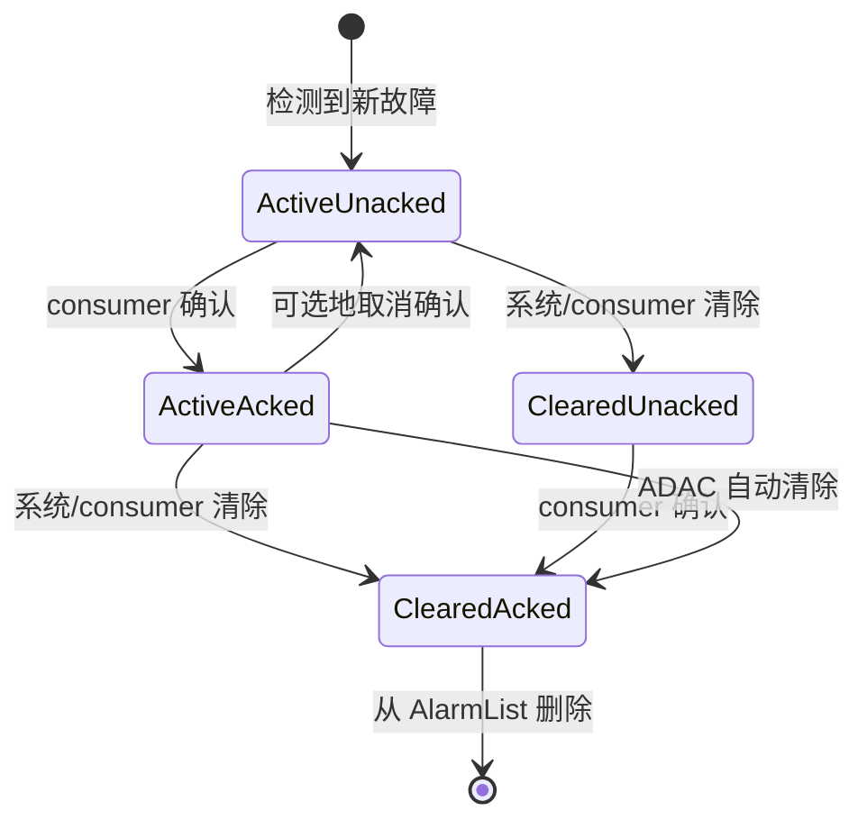
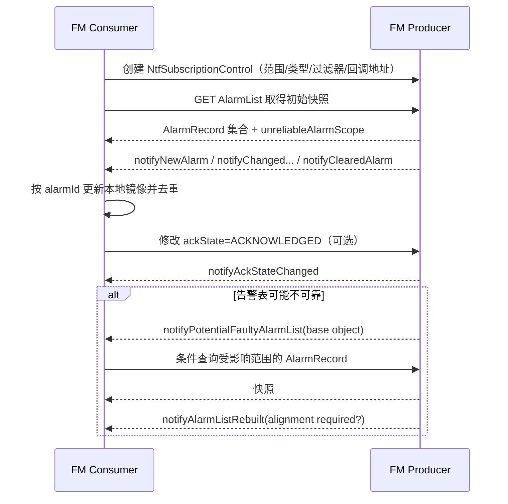

# TS 28.111 学习产出：故障监督与告警生命周期

> 规范：3GPP TS 28.111 V18.8.0，*Management and orchestration; Fault Management (FM)*。官方原文、OpenAPI 与 YANG：[28111-i80.zip](https://www.3gpp.org/ftp/Specs/archive/28_series/28.111/28111-i80.zip)。

## 1. 一句话定位

28.111 定义 5G 管理中的告警记录、告警表、告警识别、状态变化、通知、确认/清除、相关性和同步机制。核心不是“收到一条告警消息”，而是让 consumer 能维护一份与 producer **可校准的一致告警视图**。

## 2. 告警生命周期

- 新告警默认 `UNACKNOWLEDGED`。
- 自动检测自动清除（ADAC）：故障条件消失时系统将严重度设为 `CLEARED`。
- 自动检测手工清除（ADMC）：consumer 通过修改告警记录将严重度设为 `CLEARED`。
- 支持确认时，已清除告警只有在确认后才从 AlarmList 移除；不支持确认时，清除后可立即移除。

## 3. 告警如何唯一识别

系统用四个“告警识别属性”判断新事件是新告警还是既有告警的更新：

1. `objectInstance`
2. `alarmType`
3. `probableCause`
4. `specificProblem`

四者相同则更新现有 AlarmRecord，否则创建新记录。`alarmId` 用于后续通知关联，但 consumer 仍要理解这四个业务身份字段。

## 4. AlarmRecord 核心字段表

| 类别 | 字段 | 含义 |
|---|---|---|
| 标识 | `objectInstance`、`alarmId`、`notificationId` | 故障对象、告警记录及通知标识 |
| 时间 | `alarmRaisedTime`、`alarmChangedTime`、`alarmClearedTime` | 产生、最近变化和清除时间 |
| 原因 | `alarmType`、`probableCause`、`specificProblem` | 告警类型、可能原因、具体问题 |
| 状态 | `perceivedSeverity`、`ackState` | 严重度和确认状态 |
| 处理 | `proposedRepairActions`、`additionalText`、`additionalInformation` | 修复建议与补充上下文 |
| 相关性 | `correlatedNotifications`、`rootCauseIndicator` | 相关告警/通知与根因标志 |
| 门限 | `thresholdinfo`、`trendIndication`、`monitoredAttributes` | 阈值类告警和趋势信息 |
| 审计 | `ackTime`、`ackUserId`、`ackSystemId`、`clearUserId`、`clearSystemId` | 谁在何时确认/清除 |
| 保护 | `backedUpStatus`、`backUpObject` | 备份状态/对象 |

`perceivedSeverity` 枚举：`INDETERMINATE`、`CRITICAL`、`MAJOR`、`MINOR`、`WARNING`、`CLEARED`。`ackState` 枚举：`ACKNOWLEDGED`、`UNACKNOWLEDGED`。

## 5. 通知选择规则

| 变化 | 专用通知 |
|---|---|
| 新 AlarmRecord 加入 AlarmList | `notifyNewAlarm` |
| 严重度变为 CLEARED | `notifyClearedAlarm` |
| 确认状态变化 | `notifyAckStateChanged` |
| 添加评论 | `notifyComments` |
| 相关通知或根因标志变化 | `notifyCorrelatedNotificationChanged` |
| 其他告警属性变化 | `notifyChangedAlarmGeneral` |
| AlarmList 某子树可能不可靠 | `notifyPotentialFaultyAlarmList` |
| 不可靠子树重建完成 | `notifyAlarmListRebuilt` |

告警记录的创建、修改和删除不使用通用 MOI 配置通知，而使用上述告警专用通知。

`notifyNewAlarm` 的必需业务字段包括 `alarmId`、`alarmType`、`probableCause`、`perceivedSeverity`，并继承通用通知头；实际通知还可包含具体问题、阈值、相关性、修复建议和补充信息。

## 6. 故障监督流程图

查询 AlarmList 使用 28.532 的 `getMOIAttributes`。例如可以只取 `CRITICAL` 严重度或某 ManagedElement 子树下的记录，这依赖条件数据节点检索能力。

## 7. AlarmList 可靠性与同步

AlarmList 用 `unreliableAlarmScope` 指出不可靠子树的 base object DN：

- 新增一个 scope 值：相应子树可能不可靠，发送 `notifyPotentialFaultyAlarmList`。
- 移除一个 scope 值：该子树已重建，发送 `notifyAlarmListRebuilt`。
- 空值：完整 AlarmList 可靠。
- 若整个列表不可靠：scope 可指向 MnS agent 对象。

`alarmListAlignmentRequired` 告诉 consumer 是否需要重新与 producer 对齐。收到 rebuilt 通知不应无条件重拉全表；先检查是否明确要求 alignment，并尽量只同步受影响 scope。

## 8. 过滤策略

一个实用的告警订阅过滤器通常包含：

| 维度 | 示例 | 价值 |
|---|---|---|
| 对象范围 | 某 SubNetwork/ManagedElement/NF 子树 | 控制租户和运维域边界 |
| 通知类型 | 新告警、清除、严重度变化 | 避免无关通知 |
| 严重度 | CRITICAL、MAJOR | 降低噪声，但需考虑恢复通知 |
| 告警类型/原因 | 通信、设备、处理错误等 | 路由到专业团队 |
| 根因标志 | `rootCauseIndicator=true` | 优先处理根因候选 |

只订阅“产生”而不订阅“清除/变化”会造成 consumer 本地告警永远不消失，这是常见设计错误。

## 9. 端到端案例：gNB DU 链路故障

### 正常链路

1. consumer 创建订阅，范围为 `ManagedElement=gNB-001`，接收新建、变化、清除、确认和列表可靠性通知。
2. producer 检测到 DU 传输链路异常，以对象 DN、alarmType、probableCause、specificProblem 判断为新告警。
3. 创建 AlarmRecord，`perceivedSeverity=MAJOR`、`ackState=UNACKNOWLEDGED`，发送 `notifyNewAlarm`。
4. consumer 按 `alarmId` 入库、关联拓扑，并由值班人员确认；consumer 修改 `ackState`，producer 记录用户/系统/时间并发确认状态通知。
5. 链路恢复，producer 设置 `perceivedSeverity=CLEARED` 并发送清除通知。
6. 因告警已确认且清除，记录可从 AlarmList 移除；consumer 通过已收到的两类通知推断生命周期结束。

### 通知丢失补偿

1. consumer 发现通知序列空洞或收到 unreliable scope 通知。
2. 标记受影响对象子树的数据“不可信”，暂停自动关单。
3. 用 `getMOIAttributes` 按 scope/filter 获取 producer 当前 AlarmList 快照。
4. 以 `alarmId` 和四个识别属性进行新增、更新、删除对账。
5. 收到 rebuilt 且不再需要 alignment 后恢复实时处理。

### 验收清单

- `alarmId` 幂等去重，`notificationId` 用于通知去重/追踪。
- 严重度、确认状态、清除状态分开存储，不能压成一个状态值。
- 保留确认/清除操作者和时间，满足审计。
- 对 `CRITICAL/MAJOR` 有响应 SLA，对恢复和重复通知也有规则。
- 能处理 producer 重启、订阅失效、通知回调失败和告警表重建。

## 10. 学习验收

- 能背出四个告警识别属性并解释用途。
- 能区分“确认”与“清除”。
- 能根据属性变化选择正确专用通知。
- 能画出实时通知 + AlarmList 快照对账的双轨机制。
