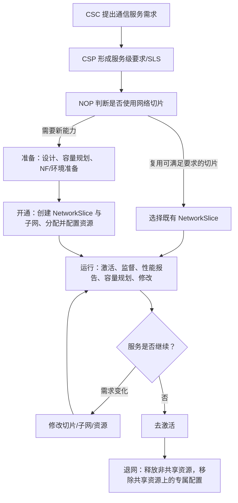

# TS 28.530 学习产出：5G 管理与网络切片的业务框架

> 规范：3GPP TS 28.530 V18.2.0，*Management and orchestration; Concepts, use cases and requirements*。官方原文：[28530-i20.zip](https://www.3gpp.org/ftp/Specs/archive/28_series/28.530/28530-i20.zip)。

## 1. 一句话定位

28.530 回答的是“**为什么管、谁来管、生命周期怎么走**”。它不定义具体 REST 报文；它把通信服务、网络切片、网络切片子网、管理角色和生命周期放在同一张业务地图上。

## 2. 先理解的五个关系

1. 通信服务可以使用一个或多个网络切片，也可以不使用切片。
2. 一个 NetworkSlice 实例可支持多个服务实例，前提是其能力满足这些服务的 SLS 要求。
3. NetworkSlice 通常由一个或多个 NetworkSliceSubnet 组成；子网可以对应 RAN、CN 或更高层组合。
4. ServiceProfile 表达面向 NetworkSlice 的服务级要求；SliceProfile 表达下沉到 NetworkSliceSubnet 的要求。
5. 服务需求变化可能触发既有切片的激活、修改或扩缩容，也可能触发新切片的创建。

## 3. 业务流程图

生命周期四阶段：

| 阶段 | 主要工作 | 关键出口 |
|---|---|---|
| Preparation | 切片设计、容量规划、NF 评估/上架、环境准备 | 已具备创建条件 |
| Commissioning | 创建 NSI，创建/修改 NSSI，分配并配置资源 | NSI 已创建，可进入激活 |
| Operation | 激活、监督、性能报告、容量规划、修改、去激活 | 满足 SLS，或形成调整/退网决定 |
| Decommissioning | 释放非共享组成，清理共享组成上的切片专属配置 | NSI 终止且不再存在 |

## 4. 核心概念表

| 概念 | 作用 | 重点属性/问题 | 与下一层关系 |
|---|---|---|---|
| Communication Service | 最终交付给客户的通信能力 | 服务类型、SLS、覆盖、容量、时延、可靠性 | 可由 NetworkSlice 支撑 |
| NetworkSlice instance（NSI） | 对外呈现的端到端逻辑网络能力 | 是否共享、运行/管理状态、满足哪些 ServiceProfile | 引用一个或多个 NSSI |
| NetworkSliceSubnet instance（NSSI） | 可独立管理和复用的切片组成 | 类型、能力、状态、资源/网络功能组成 | 引用 NF、子 NSSI、传输端点 |
| ServiceProfile | 面向 NSI 的服务要求 | 覆盖、UE 数、时延、吞吐、可靠性、可用性、SST 等 | 分解为 SliceProfile |
| SliceProfile | 面向 NSSI/组成资源的要求 | RAN/CN/TN 相关约束、容量、性能、连接要求 | 驱动 NSSI 选择或创建 |
| SLS | 服务水平约束 | 哪些指标、目标值、评估窗口、违约处理 | 驱动监控与闭环调整 |

## 5. 角色表

| 角色 | 做什么 | 学习时要问 |
|---|---|---|
| CSC | 使用通信服务 | 需求以什么形式提出，能看到多少网络细节？ |
| CSP | 设计、构建、运营通信服务 | 如何把业务 SLS 转换为网络需求？ |
| NOP | 设计、构建、运营网络及网络切片 | 复用还是新建，资源如何保证？ |
| NEP | 提供网元、软件/VNF 等 | 暴露哪些管理能力和资源模型？ |
| VISP/DCSP | 提供虚拟化基础设施/数据中心服务 | 资源能力、位置和容量如何约束切片？ |
| NSaaS Provider/Customer | 在 NSaaS 场景提供/消费切片 | 管理能力和数据暴露边界是什么？ |

一个组织可以同时扮演多个角色；一个角色也可由多个组织承担。不要把“角色”直接等同于“公司”。

## 6. 端到端案例：智慧工厂 URLLC 切片

### 输入

- 园区 A 需要 5G 专网承载运动控制。
- 目标：低时延、高可靠、限定覆盖区域、限定最大 UE 数，并要求业务时段内持续可用。
- 现网已有一个共享 RAN NSSI，但核心网侧没有满足隔离要求的 NSSI。

### 推演

1. CSC 向 CSP 提出业务 SLS；CSP 将其转为 ServiceProfile。
2. NOP 执行可行性评估：检查频谱/RAN 容量、核心网资源、传输链路和基础设施位置。
3. RAN NSSI 能满足要求且允许共享，因此复用；CN NSSI 需要新建。
4. 创建 NetworkSlice，并关联 RAN NSSI、CN NSSI 和必要的传输连接。
5. 激活 NSI，开始性能与故障监督。
6. 高峰期 KPI 接近阈值，容量规划触发 CN NSSI 扩容或配置修改。
7. 合同结束后先去激活；若组成不再被其他 NSI 使用则释放，否则只移除本 NSI 的专属配置。

### 验收问题

- 能否说清 ServiceProfile 与 SliceProfile 的边界？
- 哪些 NSSI 是共享的，退网时为何不能直接删除？
- 性能下降触发的是运行期“修改”，还是新建切片？依据是什么？
- 谁是 MnS consumer，谁是 MnS producer？跨组织时授权边界在哪里？

## 7. 读规范时的抓手

- 第 4 章：概念、原则、生命周期、角色，是本规范的主干。
- 第 5 章：把概念放入用例；重点看 NSI/NSSI provisioning、性能/故障数据报告、需求变化触发修改。
- 第 6 章：了解 SON、管理数据分析、闭环 SLS 保障等高级能力，不必在第一遍深挖。

## 8. 与其他规范衔接

- “具体怎样分配/去分配 NSI、NSSI”：TS 28.531。
- “这些对象有哪些字段、怎样关联”：TS 28.541。
- “CRUD、通知和 REST/YANG 怎么做”：TS 28.532。
- “真正的服务化管理架构框架”：TS 28.533。
