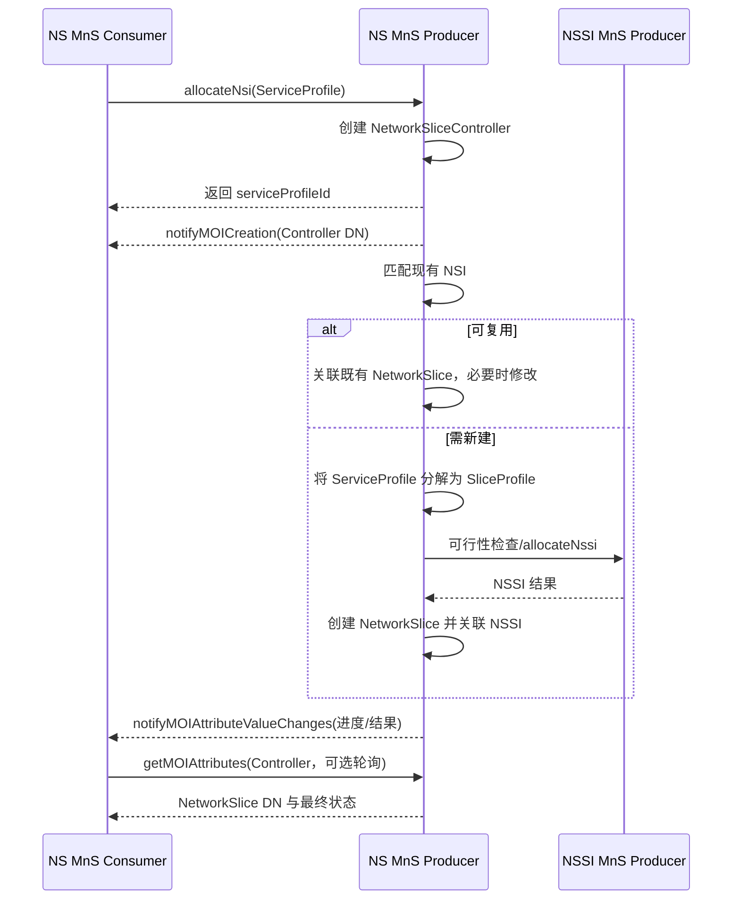
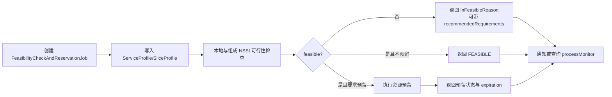

# TS 28.531 学习产出：网络与网络切片供给

> 规范：3GPP TS 28.531 V18.8.0，*Management and orchestration; Provisioning*。官方原文与 OpenAPI：[28531-i80.zip](https://www.3gpp.org/ftp/Specs/archive/28_series/28.531/28531-i80.zip)。

## 1. 一句话定位

28.531 把 28.530 的“切片生命周期”落成可执行的 **NSI/NSSI 分配、去分配、可行性检查、激活、去激活、修改和进度监控流程**。它同时给出专用的切片供给 MnS 和基于 28.532 通用 CRUD 的实现方式。

## 2. 先分清“allocate”与“create”

- `allocateNsi`/`allocateNssi` 表达业务目标：满足一组 ServiceProfile/SliceProfile 要求。
- producer 可以复用满足要求的现有 NSI/NSSI，也可以创建新的；“分配”不等于“一定新建”。
- `createMOI` 是管理对象层的通用操作，可用于创建 `NetworkSliceController`、`FeasibilityCheckAndReservationJob` 等对象。
- 长耗时流程的进度与结果通过控制器/作业对象的属性和通知异步呈现，不应把一次 HTTP 响应当成全部编排结果。

## 3. NSI 分配业务流程



规范还允许另一种入口：consumer 直接用 28.532 的 `createMOI` 创建 `NetworkSliceController`，并在 `inputServiceProfile` 中提交要求。

## 4. 关键操作与 REST 映射

| Stage 2 操作 | 业务含义 | 关键输入 | 关键输出 | Rel-18 OpenAPI 资源 |
|---|---|---|---|---|
| `allocateNsi` | 为 ServiceProfile 分配 NSI | `attributeListIn`（ServiceProfile） | `serviceProfileId`、状态 | `POST /ServiceProfiles` |
| `deallocateNsi` | 解除 ServiceProfile 与 NSI 的分配 | `networkSliceDN`、`serviceProfileId` | 状态 | `DELETE /ServiceProfiles/{ServiceProfileId}` |
| `allocateNssi` | 为 SliceProfile 分配 NSSI | `attributeListIn`（SliceProfile） | `sliceProfileId`、状态 | `POST /SliceProfiles` |
| `deallocateNssi` | 解除 SliceProfile 与 NSSI 的分配 | NSSI/SliceProfile 标识 | 状态 | `DELETE /SliceProfiles/{SliceProfileId}` |
| `createMOI` | 创建控制器/可行性作业等 | class、DN、属性 | 创建结果/DN | 使用 TS 28.532 ProvMnS |
| `modifyMOIAttributes` | 修改 NSI、NSSI 或控制器 | DN、修改列表 | 成功/部分失败/失败 | 使用 TS 28.532 `PATCH`/`PUT` |

专用服务的基 URI：

- `{MnSRoot}/NSProvMnS/{MnSVersion}`
- `{MnSRoot}/NSSProvMnS/{MnSVersion}`

## 5. 核心对象/字段表

| 对象 | 关键字段 | 用途 |
|---|---|---|
| `ServiceProfile` | `serviceProfileId`、`sst`、`coverageArea`、时延、吞吐、可靠性、可用性、UE/PDU 会话容量等 | 描述 NSI 要满足的业务要求 |
| `SliceProfile` | `sliceProfileId`、`plmnInfoList`、`cNSliceSubnetProfile`、`rANSliceSubnetProfile`、`topSliceSubnetProfile` | 描述 NSSI 要满足的下层要求 |
| `NetworkSliceController` | `inputServiceProfile`、`networkSliceRef`、`processMonitor`、管理/运行/可用状态 | 控制并监视异步 NSI 分配/修改过程 |
| `NetworkSliceSubnetController` | `inputSliceProfile`、`networkSliceSubnetRef`、`processMonitor`、状态 | 控制并监视异步 NSSI 分配/修改过程 |
| `FeasibilityCheckAndReservationJob` | `profile`、`resourceReservation`、`feasibilityTimeWindow`、`feasibilityResult`、失败原因、预留状态/过期时间、建议要求 | 在真正分配前检查并可选预留资源 |

## 6. 可行性检查与预留



删除可行性检查/预留作业时，producer 会取消与该作业关联的资源预留。这是实现中容易漏掉的生命周期清理点。

## 7. 端到端案例：分配园区 URLLC NSI

### 请求示意

```http
POST /3GPPManagement/NSProvMnS/18.6.0/ServiceProfiles
Content-Type: application/json

{
  "serviceProfileId": "factory-a-urllc-01",
  "sst": 2,
  "maxNumberofUEs": 500,
  "dLLatency": 5,
  "uLLatency": 5,
  "availability": 99.999
}
```

> 示例只展示学习所需字段；合法类型、单位、条件约束和完整属性以所用版本的 `TS28531_NSProvMnS.yaml` 与 `TS28541_SliceNrm.yaml` 为准。

### 预期交互

1. producer 接收 ServiceProfile，并创建 `NetworkSliceController`。
2. consumer 获得 `serviceProfileId`，随后收到控制器创建通知。
3. producer 发现既有共享 RAN NSSI 可用，但需要新建 CN NSSI。
4. producer 下沉一个 SliceProfile，执行 NSSI 可行性检查与分配。
5. 新建 `NetworkSlice`，写入 `networkSliceSubnetRef` 与 `networkSliceControllerRef`。
6. controller 的 `processMonitor` 和状态字段持续变化，consumer 通过通知或 GET 获取进度。
7. 成功后，consumer 得到 `networkSliceRef`，再执行激活流程。

### 异常分支

- 资源不可行：返回 `inFeasibleReason`；若有替代配置，读取 `recommendedRequirements`。
- 只部分满足：不得把“已创建 controller”误判为“NSI 已成功分配”。
- 共享资源：去分配 ServiceProfile 时可能只是修改 NSI，而不是终止整个 NSI。
- 超时：查询 controller/job 的 `processMonitor`，不要无条件重复创建请求。

## 8. 学习验收

- 能解释为何 `allocateNsi` 可能复用现有 NSI。
- 能画出 ServiceProfile → SliceProfile → NSSI → NetworkSlice 的分解链。
- 能说明同步 HTTP 响应、控制器 MOI、属性变化通知三者各承担什么职责。
- 能列出可行性作业的终态、失败原因、资源预留与过期处理。
