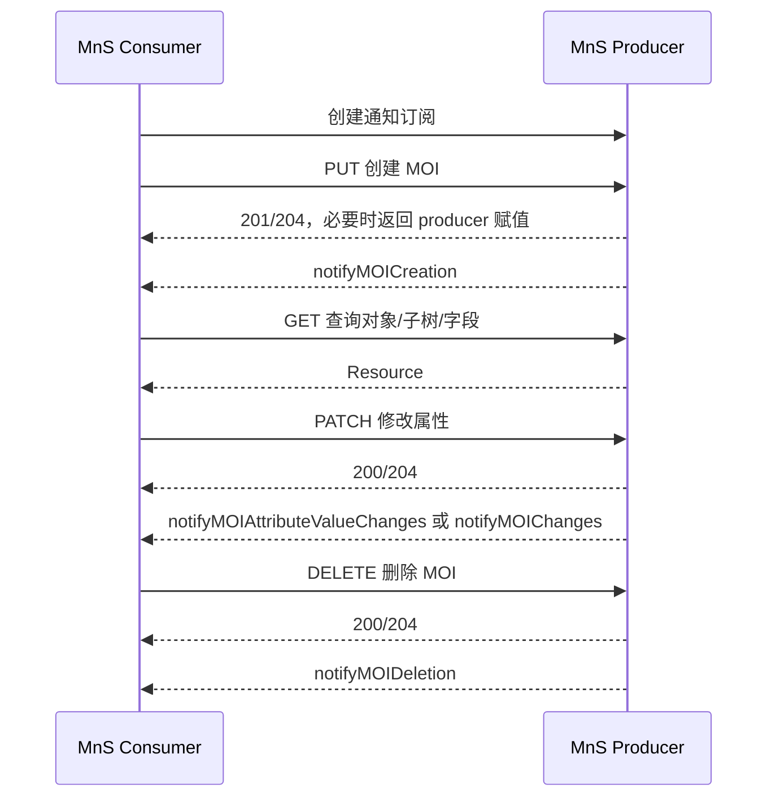
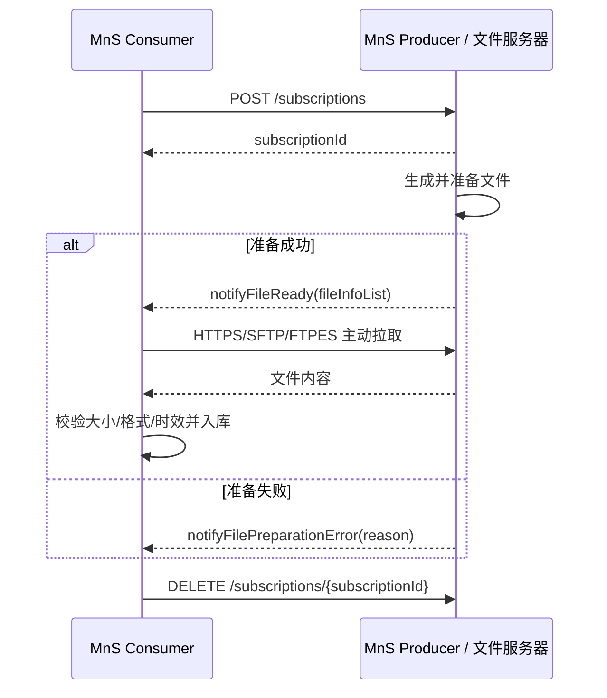

# TS 28.532 学习产出：通用管理服务与 REST/YANG 接口

> 规范：3GPP TS 28.532 V18.8.0，*Management and orchestration; Generic management services*。官方原文、OpenAPI 和相关附件：[28532-i80.zip](https://www.3gpp.org/ftp/Specs/archive/28_series/28.532/28532-i80.zip)。

## 1. 一句话定位

28.532 是五类业务的“接口工具箱”：第 11 章定义 Stage 2 的业务操作/通知，第 12 章把它们映射成 RESTful HTTP、YANG/NETCONF、文件格式和流式上报方案。

## 2. 服务全景

| 服务 | Stage 2 入口 | Stage 3 入口 | 主要能力 |
|---|---|---|---|
| Generic provisioning MnS | 11.1 | 12.1 | MOI 的创建、查询、修改、删除和配置变更通知 |
| Generic fault supervision MnS | 11.2a | 具体告警模型主要见 28.111 | 告警监督能力的通用入口 |
| Performance assurance | 11.3 | 12.3 | 阈值越限通知、性能数据文件格式 |
| Heartbeat | 11.4 | 12.4 | producer 活性通知 |
| Streaming data reporting | 11.5 | 12.5 | 建连、加/删流、查询连接与流、上报流数据 |
| File data reporting | 11.6 | 12.6 | 订阅、退订、列举文件、文件就绪/准备失败通知 |

## 3. 配置管理流程图



## 4. Stage 2 CRUD 与 Stage 3 映射

| Stage 2 | 关键参数 | REST 映射 | NETCONF/YANG 映射 |
|---|---|---|---|
| `createMOI` | `managedObjectClass`、`managedObjectInstance`、`attributeListIn` | `PUT /{className}={id}`；不存在则创建 | `<edit-config>`，目标 list 的 `operation="create"` |
| `getMOIAttributes` | `baseObjectInstance`、scope/filter/attributes 或 `dataNodeSelector` | `GET /{className}={id}` + `scope`、`filter`、`attributes`、`fields` 等查询参数 | `<get>` 或 `<get-config>` + subtree/XPath filter |
| `modifyMOIAttributes` | base/scope/filter、顺序化 `modificationList` | 单资源完整替换用 `PUT`；部分修改用 `PATCH` | `<edit-config>`，明确列出要修改的 MOI 与节点 |
| `deleteMOI` | base/scope/filter | `DELETE /{className}={id}`，REST 定义删除单资源 | `<edit-config>` + `operation="delete"`/`remove` |
| `changeMOIs` | base、批量 modifications | 3GPP merge/json patch | `<edit-config>` |

REST 的通用服务根形如：

```text
{MnSRoot}/ProvMnS/{MnSVersion}/{URI-LDN-first-part}/{className}={id}
```

### REST PATCH 媒体类型

- `application/merge-patch+json`
- `application/vnd.3gpp.merge-patch+json`
- `application/json-patch+json`
- `application/vnd.3gpp.json-patch+json`

JSON Patch 的 `PatchItem` 至少包含 `op` 和 `path`，按操作还可有 `from`、`value`。Stage 2 的修改语义包括 replace、add、remove、setToDefault；协议层还可能支持 copy/move，但它们没有对应的 Stage 2 定义，支持是可选的。

## 5. Scope、filter 与字段选择

| 项 | 含义 | 常见误区 |
|---|---|---|
| `BASE_ONLY` | 只选 base object | 不会自动带子对象 |
| `BASE_ALL` | base 及其所有下级 | 数据量可能非常大 |
| `BASE_NTH_LEVEL` | 只选 base 下第 N 层 | NETCONF 需要 XPath 能力 |
| `BASE_SUBTREE` | base 到指定深度的子树 | 与“所有后代”不是同义，注意 level |
| `filter` | 对候选对象按类/属性条件过滤 | REST 单资源 PUT/PATCH/DELETE 时无意义 |
| `attributes`/`fields` | 控制返回哪些属性/数据节点 | 不是对象筛选条件 |

## 6. 配置通知核心字段

| 通知 | 何时使用 | 关键字段 |
|---|---|---|
| `notifyMOICreation` | MOI 创建 | 通知头、`sourceIndicator`、`attributeList`、相关通知 |
| `notifyMOIDeletion` | MOI 删除 | 通知头、源指示、附加文本 |
| `notifyMOIAttributeValueChanges` | 属性值变化 | 通知头、`attributeListValueChanges`（必需）、源指示 |
| `notifyEvent` | 无更专用类型的一般事件 | 通知头、事件信息 |
| `notifyMOIChanges` | 用一组变更统一描述创建/删除/更新 | `notificationId`、`op`、`path`、`value`、`oldValue` 等 |

## 7. 文件数据上报流程



`FileInfo` 的学习重点：

| 字段 | 含义 |
|---|---|
| `fileLocation` | 可获取文件的 URI |
| `fileSize` | 文件大小，用于传输校验 |
| `fileReadyTime` | 文件可用时间 |
| `fileExpirationTime` | producer 承诺保存到的时间窗口 |
| `fileCompression` | 压缩方式 |
| `fileFormat` | 文件格式 |
| `fileDataType` | 数据类型，如性能相关数据 |

producer 至少支持 SFTP、FTPES、HTTPS 之一；producer 始终是服务器，consumer 始终发起文件传输。

## 8. 性能阈值通知

`notifyThresholdCrossing` 的主要字段包括：

| 字段 | 含义 |
|---|---|
| `observedPerfMetricName` | 被观察的性能指标名称 |
| `observedPerfMetricValue` | 实测值 |
| `observedPerfMetricDirection` | 指标变化/越限方向 |
| `thresholdValue` | 阈值 |
| `hysteresis` | 回滞值，防止阈值附近反复抖动通知 |
| `monitorGranularityPeriod` | 阈值判断使用的监控粒度周期 |
| `additionalText` | 附加说明 |

阈值监控对象及其范围、阈值列表、管理/运行状态见 28.622；性能业务要求与测量任务见 28.550。

## 9. REST 与 YANG/NETCONF 的思维映射

| 信息模型概念 | REST/JSON | YANG/NETCONF |
|---|---|---|
| 对象树 | URI 路径和嵌套 Resource | YANG data tree |
| 对象实例标识 | `{className}={id}` 形成 URI/DN 路径 | list key（通常为 `id`）与嵌套 XML 元素 |
| 创建/修改/删除 | PUT/PATCH/DELETE | `<edit-config>` + operation 属性 |
| 查询 | GET + scope/filter/fields | `<get>`/`<get-config>` + subtree/XPath filter |
| 成功结果 | HTTP 状态码与可选响应体 | `<rpc-reply><ok/>`；值通常需另行 GET |
| 错误 | HTTP 状态码 + error body | `<rpc-error>`、`error-tag`、`error-path` |

一个重要差异：成功的 NETCONF `<edit-config>` 通常只返回 `<ok/>`，不会返回 Stage 2 的 `attributeListOut`；需要随后用 `<get-config>` 回读。

## 10. 端到端案例：用 REST 创建并修改 `NrCellDu`

### 创建（示意）

```http
PUT /3GPPManagement/ProvMnS/18.6.0/SubNetwork=OperatorA/ManagedElement=gNB-001/GnbDuFunction=1/NrCellDu=cell-01
Content-Type: application/json

{
  "id": "cell-01",
  "attributes": {
    "administrativeState": "LOCKED",
    "cellLocalId": 1,
    "nrPci": 101,
    "arfcnDL": 633984,
    "bSChannelBwDL": 100
  }
}
```

### 部分修改（示意）

```http
PATCH /3GPPManagement/ProvMnS/18.6.0/SubNetwork=OperatorA/ManagedElement=gNB-001/GnbDuFunction=1/NrCellDu=cell-01
Content-Type: application/json-patch+json

[
  {"op":"replace", "path":"/attributes/administrativeState", "value":"UNLOCKED"}
]
```

### 验收步骤

1. 创建前确认父对象存在；规范要求不能在不存在的父对象下创建子对象。
2. 检查 201/204，并在需要时 GET 回读 producer 自动赋值。
3. 订阅端应收到创建/属性变更通知，并按 `notificationId` 去重。
4. 修改后检查模型约束、运行状态和配置是否真正生效；HTTP 成功不必然等于业务功能已经进入终态。
5. 删除前检查对象引用和包含关系，避免破坏 NRM 约束。

> URI、类名大小写、属性约束和响应码以部署所采用的 OpenAPI/NRM 版本为准。本例用于建立“DN → 资源 URI → JSON Resource → 通知”的映射。

## 11. 学习验收

- 能把 create/get/modify/delete 分别映射到 REST 和 NETCONF。
- 能解释 scope/filter/fields 的不同职责。
- 能画出“订阅 → 文件就绪 → consumer 拉取”的文件链路。
- 能说明为什么配置接口返回成功后仍要回读、收通知或查看异步作业状态。
