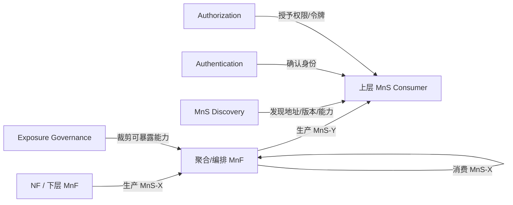
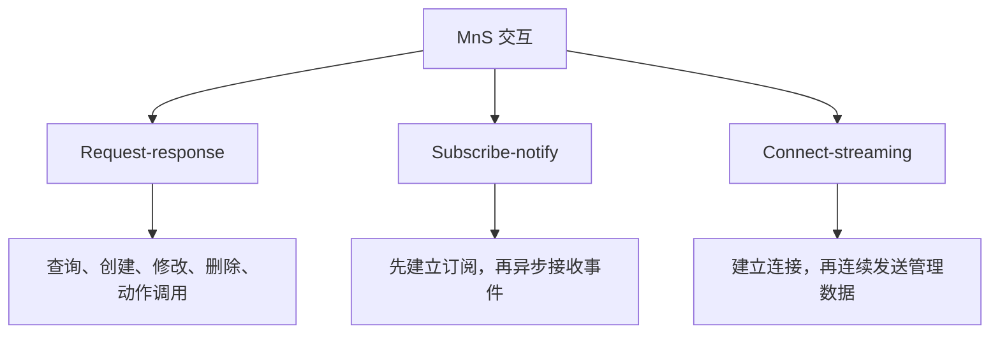
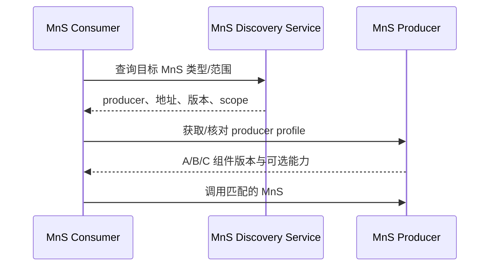
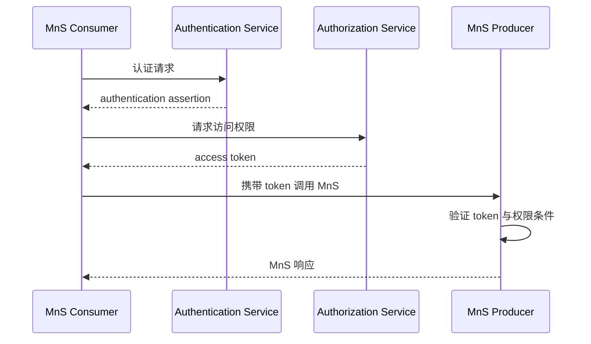
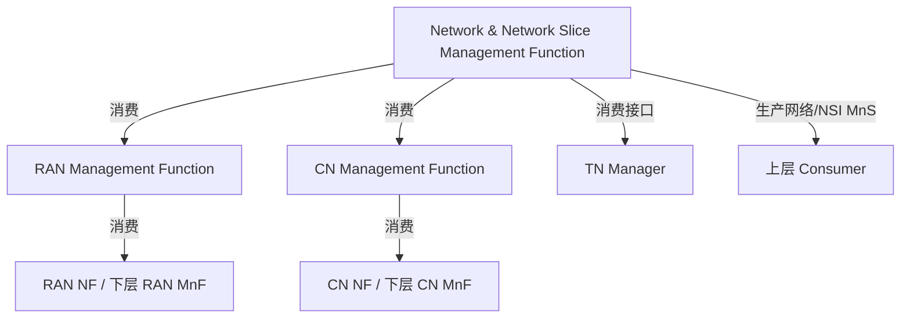

# TS 28.533 学习笔记：服务化管理架构框架

> 规范：3GPP TS 28.533 V18.4.0，*Management and orchestration; Architecture framework*。官方原文：[28533-i40.zip](https://www.3gpp.org/ftp/Specs/archive/28_series/28.533/28533-i40.zip)。

## 1. 一句话定位

28.533 回答的是：**管理能力由谁生产、被谁消费、以什么服务组件组合、通过什么交互方式暴露，以及如何被发现、授权、聚合和跨域使用。**

它的核心是 Service Based Management Architecture（SBMA），最小思考单位不是传统固定网管接口，而是 Management Service（MnS）。

## 2. 今天必须带走的六个结论

1. **MnS 是 SBMA 的基本构件**：它是一组面向网络和服务管理编排的可提供能力。
2. **producer/consumer 是角色，不是固定产品**：同一个逻辑实体可以消费下层 MnS，再生产上层 MnS。
3. **MnS 由 A/B/C 三类独立组件组合**：A 是操作/通知，B 是信息模型，C 是性能和故障信息。
4. **一个具体 MnS 至少包含 A+B**；涉及性能或故障语义时，可组合 A+B+C。
5. **MnF 是逻辑实体**：它可扮演 MnS producer、consumer，或同时扮演二者；可以独立部署，也可以嵌入 NF。
6. **服务化不等于无边界开放**：发现、producer profile、暴露治理、多租户、认证和授权共同决定“谁能看到并使用什么能力”。

## 3. 核心架构图



关键理解：中间的 MnF 不是简单转发器。它可以聚合多个下层 MnS、处理管理信息、形成新的管理能力，再向上暴露不同的 MnS。

## 4. MnS、MnF、producer、consumer

| 概念 | 定义 | 容易混淆的点 |
|---|---|---|
| MnS | 一组对外提供的管理和编排能力 | 不是单个 API，也不等于一个进程 |
| MnS producer | 提供某个 MnS 的实体角色 | 一个实体可生产多个 MnS |
| MnS consumer | 使用某个 MnS 的实体角色 | 使用前需要适当认证和授权 |
| MnF | 扮演 producer 和/或 consumer 的逻辑实体 | 可独立部署，也可嵌入 NF；规范不规定其内部实现 |
| MnS producer profile | 描述 producer 支持的组件、版本和可选特性 | consumer 不能仅凭服务名称假设所有可选能力均支持 |

producer/consumer 的角色关系是针对“某一个 MnS”而言的。例如网络切片管理 MnF 对上层是 producer，对 RAN/CN 域管理 MnF 又是 consumer。

## 5. MnS 的 A/B/C 三类组件

| 组件类型 | 表达什么 | 典型内容 | 本套规范中的例子 |
|---|---|---|---|
| Type A | 与具体受管实体无关的操作和通知 | create/read/update/delete、通用订阅与通知 | TS 28.532 的通用 provisioning 操作 |
| Type B | 受管实体的信息模型，即 NRM | 类、属性、关系、对象树 | TS 28.622 通用 NRM、TS 28.541 5G NRM |
| Type C | 受管实体的性能或故障信息 | 测量、KPI、告警语义 | TS 28.552/28.554 性能信息、TS 28.111 告警信息 |

组合规则：

```text
具体 MnS = Type A + Type B
或
具体 MnS = Type A + Type B + Type C
```

### 组合示例

| MnS | Type A | Type B | Type C |
|---|---|---|---|
| 配置管理服务 | CRUD 与配置通知 | 5G NRM 中的 `NrCellDu` 等对象 | 不需要 |
| 故障监督服务 | 查询、订阅、告警通知操作 | 28.541/28.622 中被监督的受管对象 | 28.111 的 AlarmRecord、告警类型、原因、严重度等故障信息 |
| 性能文件报告服务 | 任务控制、文件通知/列举 | `PerfMetricJob`、`Files`、NF/NSI/NSSI 对象 | 测量类型或 KPI 定义 |

这一拆分让同一套 Type A 操作可以复用于不同 Type B 模型，也让模型与协议实现保持解耦。

## 6. 三种基本交互范式



| 范式 | 发起方式 | 适用场景 | 学习实例 |
|---|---|---|---|
| Request-response | consumer 请求，producer 响应 | CRUD、查询、动作调用 | GET/PUT/PATCH/DELETE MOI |
| Subscribe-notify | consumer 建立订阅，producer 事件触发通知 | 告警、配置变化、文件就绪、阈值越限 | `NtfSubscriptionControl` + notifications |
| Connect-streaming | producer 获得 consumer 地址并建立数据流连接 | 高频或连续性能/分析数据 | 28.532 streaming data reporting |

实际业务经常组合使用三者：先 request-response 创建测量任务，再 subscribe-notify 接收状态或文件通知，同时用 connect-streaming 交付实时数据。

## 7. 服务发现与 producer profile

consumer 在调用 MnS 前需要解决两个问题：

1. **去哪调用**：发现可用 MnS 实例、地址和管理范围。
2. **它具体支持什么**：读取 producer profile，确认组件版本和可选特性。



28.622 的 `MnsRegistry`/`MnsInfo` 为服务发现提供模型基础，其中包括 `mnsType`、`mnsVersion`、`mnsAddress`、`mnsScope` 等信息。

## 8. 暴露治理与多租户

### 暴露治理

Management capability exposure governance 用来把原始 MnS-A 经过策略裁剪后形成 MnS-A'。治理可作用于 A/B/C 三类组件，例如：

- 只暴露 GET，不允许修改或删除；
- 只暴露某一 NRM 子树或字段；
- 只开放部分性能指标或告警类型；
- 对外隐藏内部拓扑、共享资源和其他租户信息。

### 多租户

tenant 在本规范中表示：**一组 MnS consumers，以及它们按 SLA 被允许访问和消费的管理能力集合。**

多租户隔离至少要同时考虑：

| 维度 | 需要限制什么 |
|---|---|
| 操作 | 哪些 Type A 操作允许调用 |
| 数据 | 哪些 Type B 对象、属性和 scope 可见 |
| 性能/故障 | 哪些 Type C 指标、告警和文件可见 |
| 通知 | 订阅范围、过滤器和回调地址是否合法 |
| 资源 | 速率、任务数、流连接数、文件保留等配额 |

## 9. 访问控制

### 显式认证与授权



### 隐式认证与授权

consumer 直接建立到 producer 的管理会话；producer 代表该会话完成认证，并用本地或从集中授权服务同步的策略执行访问控制。认证/授权服务可以部署在域内，也可以集中部署以支持跨域访问。

认证解决“你是谁”，授权解决“你可以做什么、访问哪部分数据”。TLS/SSH 建立安全传输并不自动等于拥有业务操作权限。

## 10. 架构参考模型中的域聚合



顶层 Network and Network Slice Management Function 消费 RAN、CN 和 TN 的管理能力，形成网络或切片级 MnS。RAN/CN 域 MnF 还可以继续消费更下层的 NSSI/NF MnS。这体现了 SBMA 的分层聚合，但规范不要求每一层必须对应一个固定物理系统。

## 11. 与 NFV MANO 的关系

3GPP 管理系统需要能够消费 NFV MANO 接口，例如 Os-Ma-nfvo、Ve-Vnfm-em、Ve-Vnfm-vnf 等参考点，用于：

- Network Service 生命周期管理；
- VNF 生命周期管理；
- 支撑 VNF 的资源性能、故障和配置管理。

3GPP MnS 负责网络/服务管理语义，NFV MANO 负责虚拟化资源与 NS/VNF 生命周期，两者通过消费关系协作，而不是互相替代。

## 12. 端到端案例：跨 RAN/CN 的网络切片管理

### 场景

上层编排系统需要创建并运行一个园区切片。RAN、CN 分别由不同域管理系统负责，租户只能看到自己的切片状态和性能数据。

### 架构推演

1. 上层 consumer 通过 Discovery 找到 Network Slice MnS producer，核对 producer profile 与版本。
2. 显式认证后取得仅限 `tenant=FactoryA`、特定 scope 和操作集的授权令牌。
3. 顶层 Network Slice MnF 接收请求；它同时是 RAN/CN/TN MnS 的 consumer。
4. 顶层 MnF 消费 RAN NSSI、CN NSSI 和传输管理能力，执行可行性检查和分配。
5. RAN/CN 域 MnF 必要时继续消费 NF 级 CRUD、性能和故障 MnS。
6. 顶层 MnF 聚合下层状态，向上生产 NSI 级状态、告警和性能 MnS。
7. Exposure Governance 形成租户专用 MnS-A'：隐藏共享资源和其他租户对象，只开放授权操作与数据。
8. consumer 通过 request-response 查询/控制，通过 subscribe-notify 收取状态和告警，通过 streaming 或文件取得性能数据。

### 架构验收

- 每条调用都能标出 producer 与 consumer；同一 MnF 的双重角色清楚。
- 每个 MnS 能列出 A/B/C 组件及版本。
- Discovery、profile、authentication、authorization、governance 的职责不混淆。
- 租户 scope 在 CRUD、通知、性能文件和流数据中保持一致。
- 下层失败能被聚合成上层可理解的过程状态与错误，而不是只透传技术异常。

## 13. 今日自测题

1. 为什么 MnS 不能只包含 Type A？
2. Type B 与 Type C 的边界是什么？`AlarmRecord` 应如何理解？
3. 一个 MnF 在什么场景下同时是 producer 和 consumer？
4. Request-response、Subscribe-notify、Connect-streaming 各举一个 28.532 例子。
5. Discovery 与 producer profile 分别解决什么问题？
6. Exposure Governance 与 Authorization 有何区别？
7. 如何防止租户通过通知或性能文件看到其他租户数据？

如果可以在不看笔记的情况下，用 3 分钟讲清 MnS、A/B/C、MnF、三种交互范式和访问控制，你就已经抓住 28.533 的主干。

## 14. 与其他规范的衔接

| 问题 | 下一份规范 |
|---|---|
| 管理对象与网络切片的业务概念是什么 | TS 28.530 |
| NSI/NSSI 如何分配、修改和退网 | TS 28.531 |
| 通用 CRUD、通知、REST/YANG 如何定义 | TS 28.532 |
| 具体 5G 资源模型有哪些 | TS 28.541 |
| 性能和故障信息如何定义 | TS 28.550、TS 28.111、TS 28.552、TS 28.554 |

## 15. 明日学习任务：用 28.530 给架构填入业务

### 明日目标

把今天的“MnS 架构语言”映射到 5G 网络切片的业务角色与生命周期，回答：**谁为了什么业务目标，消费哪些 MnS，最终管理哪些对象？**

### 任务单（约 2 小时）

1. **20 分钟：闭卷复盘 28.533**
   - 写出 MnS、MnF、producer、consumer 的定义；
   - 画出 A+B 与 A+B+C；
   - 写出三种交互范式。

2. **60 分钟：阅读 28.530 主干**
   - 4.1：通信服务、NetworkSlice 与服务实例关系；
   - 4.3：Preparation、Commissioning、Operation、Decommissioning；
   - 4.6：ServiceProfile 与 SliceProfile；
   - 4.8：CSC、CSP、NOP 等角色；
   - 5.4.2、5.4.3：NSI/NSSI provisioning 高层用例。

3. **30 分钟：做一张映射表**

| 业务角色/对象 | 在 28.533 中扮演什么 | 需要的 MnS |
|---|---|---|
| CSP/NOP | consumer、producer 或二者 | 配置、性能、故障、切片供给 |
| NetworkSlice | Type B 管理信息 | CRUD + 状态/性能/故障信息 |
| ServiceProfile | 业务要求输入 | NSI 分配/修改 MnS |
| RAN/CN NSSI | 下层受管资源与域级服务 | NSSI provisioning、PM、FM |

4. **10 分钟：口头讲一个案例**
   - 以“园区 URLLC 切片”为例，从 CSC 需求讲到 NOP 创建/复用 NSSI；
   - 每一步标出 MnS producer、consumer 和交互范式。

### 明日验收产出

- 一张“28.530 业务角色/生命周期 ↔ 28.533 SBMA”映射图；
- 一张 ServiceProfile → NSI → NSSI → NF 的对象关系草图；
- 一段不超过 5 分钟的口头讲解；
- 能独立回答本笔记第 13 节至少 6 道题。

完成后，下一步进入 TS 28.531，把业务生命周期落实为可行性检查、分配、激活、修改和去分配流程。
