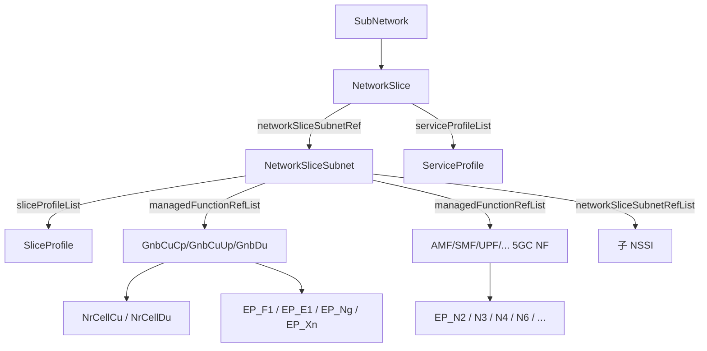
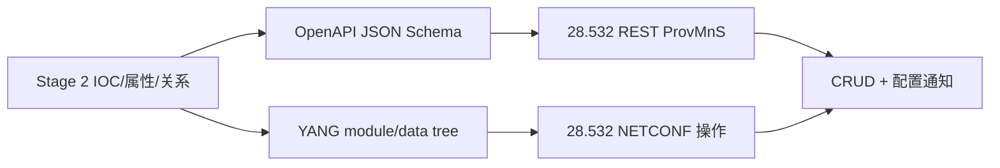

# TS 28.541 学习产出：5G 网络资源模型（NRM）

> 规范：3GPP TS 28.541 V18.15.0，*Management and orchestration; 5G Network Resource Model (NRM); Stage 2 and stage 3*。官方原文、OpenAPI 与 YANG：[28541-if0.zip](https://www.3gpp.org/ftp/Specs/archive/28_series/28.541/28541-if0.zip)。

## 1. 一句话定位

28.541 回答“**5G 里到底在管理哪些对象、对象有哪些属性、对象怎样关联**”。它把切片、NG-RAN、5GC、端点和策略/控制对象建成可被 28.532 CRUD 的信息模型，并提供 JSON/OpenAPI 与 YANG 方案。

## 2. 三个主模型

| 模型 | 典型对象 | 解决的问题 |
|---|---|---|
| Slice NRM | `NetworkSlice`、`NetworkSliceSubnet`、`ServiceProfile`、`SliceProfile`、Controller、Feasibility Job | 切片需求、组成、状态、分配控制与可行性 |
| NR NRM | `GnbCuCpFunction`、`GnbCuUpFunction`、`GnbDuFunction`、`NrCellCu`、`NrCellDu`、`NrSectorCarrier`、端点/邻区/频点 | NG-RAN 功能拆分、无线小区、频率、邻接和接口关系 |
| 5GC NRM | `AmfFunction`、`SmfFunction`、`UpfFunction`、`NrfFunction`、`NssfFunction`、`NwdafFunction`、`EP_Nx` | 5GC 网络功能、能力、切片支持信息及标准接口端点 |

## 3. 资源关系图

学习时先画“包含关系”，再画 `xxxRef` 引用关系。包含关系决定对象树和 DN；引用关系表达逻辑关联，二者不能混为一谈。

## 4. 切片核心对象/字段

| 对象 | 关键字段 | 读法 |
|---|---|---|
| `NetworkSlice` | `networkSliceSubnetRef`、`serviceProfileList`、`administrativeState`、`operationalState`、controller/isolation 引用 | 一个 NSI 的组成、要求和状态 |
| `NetworkSliceSubnet` | `managedFunctionRefList`、`networkSliceSubnetRefList`、`sliceProfileList`、`epTransportRefList`、`priorityLabel`、`networkSliceSubnetType`、状态 | 一个 NSSI 包含/引用哪些资源和子 NSSI |
| `ServiceProfile` | `serviceProfileId`、`sst`、`coverageArea`、`maxNumberofUEs`、时延、吞吐、可靠性、可用性、能效等 | 面向 NSI 的 SLS 要求集合 |
| `SliceProfile` | `sliceProfileId`、`plmnInfoList`、CN/RAN/TOP subnet profile | 下沉到 NSSI 的要求集合 |
| `FeasibilityCheckAndReservationJob` | `profile`、`resourceReservation`、`feasibilityTimeWindow`、`processMonitor`、`feasibilityResult`、失败/预留结果 | 可行性检查与可选资源预留 |

`networkSliceSubnetType` 的值包括 `TOP_SLICESUBNET`、`RAN_SLICESUBNET`、`CN_SLICESUBNET`。

## 5. NG-RAN 核心对象/字段

| 对象 | 关键字段/子对象 | 用途 |
|---|---|---|
| `GnbCuCpFunction` | `gnbId`、`gnbIdLength`、`plmnId`、CU 名称、允许/阻止列表；含 `NrCellCu`、RRM 策略、E1/F1C/NgC/XnC 等端点 | gNB CU 控制面功能 |
| `GnbCuUpFunction` | CU-UP 标识、名称、关联信息；含 E1/XnU/F1U/NgU 等端点 | gNB CU 用户面功能 |
| `GnbDuFunction` | `gnbDuId`、`gnbDuName`、`gnbId`、`gnbIdLength`；含 `NrCellDu`、BWP、扇区载波、F1 端点 | gNB 分布单元功能 |
| `NrCellDu` | 管理/运行状态、`cellLocalId`、`cellState`、`plmnInfoList`、`nrPci`、`nrTac`、上下行 ARFCN、带宽、SSB、载波/BWP 引用 | 无线小区 DU 侧配置 |
| `NrCellRelation` | 目标小区、偏置/切换相关信息 | NR 邻区关系 |
| `NrFrequency`/`NrFreqRelation` | 频率配置和小区到频率的关系 | 频点与异频关系 |

## 6. 5GC 核心对象/字段

| 对象 | 关键字段/子对象 | 用途 |
|---|---|---|
| `AmfFunction` | PLMN、`amfIdentifier`、SBI FQDN、CNSI、NF profile、`amfInfo`；N2/N8/N11/N12/N14/N15 等端点 | 接入与移动管理功能 |
| `SmfFunction` | PLMN、TA、SBI FQDN、CNSI、NF profile、`smfInfo`、5QI 集引用；N4/N7/N10/N11/N16 等端点 | 会话管理功能 |
| `UpfFunction` | PLMN、TA、CNSI、能耗控制/状态、NF profile、`upfInfo`；N3/N4/N6/N9 端点 | 用户面功能 |
| `NrfFunction` | NF profile/服务注册发现相关信息 | NF 注册与发现 |
| `NssfFunction` | 切片选择相关能力与支持信息 | 切片选择 |
| `NwdafFunction` | analytics 能力与信息 | 网络数据分析 |

端点对象不是装饰字段。`EP_N3`、`EP_N4`、`EP_N6` 等把功能对象与接口连接关系显式化，是拓扑、配置和故障定位的重要抓手。

## 7. 从模型到接口

28.541 定义资源“长什么样”；28.532 定义“如何访问”。不要在 28.541 中寻找完整的通用 CRUD 流程，也不要只读 28.532 而不知道 JSON/YANG 中具体有哪些 5G 对象。

## 8. 端到端案例：建立一个切片资源视图

### 目标

为园区切片建立如下资源关系：

- `NetworkSlice=FactoryA`
- 一个 RAN NSSI，复用 `GnbCuCpFunction=1`、`GnbDuFunction=1` 与两个 `NrCellDu`
- 一个 CN NSSI，引用 `AmfFunction=1`、`SmfFunction=1`、`UpfFunction=FactoryA`
- NSI 的 `serviceProfileList` 表达时延、可靠性、覆盖和容量要求

### 实施步骤

1. 查询候选 NF 和小区对象，确认状态、PLMN、能力、端点与引用完整。
2. 创建或选择 RAN/CN `NetworkSliceSubnet`，写入 `managedFunctionRefList` 和 `sliceProfileList`。
3. 创建 `NetworkSlice`，写入 `networkSliceSubnetRef` 与 `serviceProfileList`。
4. 通过 controller/作业对象跟踪分配和配置过程，而不是仅检查对象是否存在。
5. 激活前验证每条 DN 引用可解析、端点关系完整、状态组合合法。
6. 运行期把 PM/FM 数据按 NSI/NSSI 与底层 NF 关联，支持端到端故障和性能分析。

### 验收清单

- 能从 NSI 追到 NSSI，再追到 RAN/5GC NF 和端点。
- 能区分 `serviceProfileList` 与 `sliceProfileList`。
- 能解释 `administrativeState` 和 `operationalState` 为什么要同时观察。
- 能识别“对象包含”与“DN 引用”的差别，并检查悬空引用。
- 能用 28.532 对任一具体对象完成 GET/PATCH 演练。

## 9. 阅读策略

28.541 体量很大，不建议从头线性阅读：

1. 先看通用建模规则和继承/包含图。
2. 按场景只选一个模型片段：Slice、NR 或 5GC。
3. 对照归档包中的 `TS28541_*Nrm.yaml` 查看 JSON schema。
4. 再对照 `_3gpp-*.yang` 理解同一对象在 YANG data tree 中的映射。
5. 最后用一条 DN 做 CRUD、通知、PM、FM 的跨规范串联。
