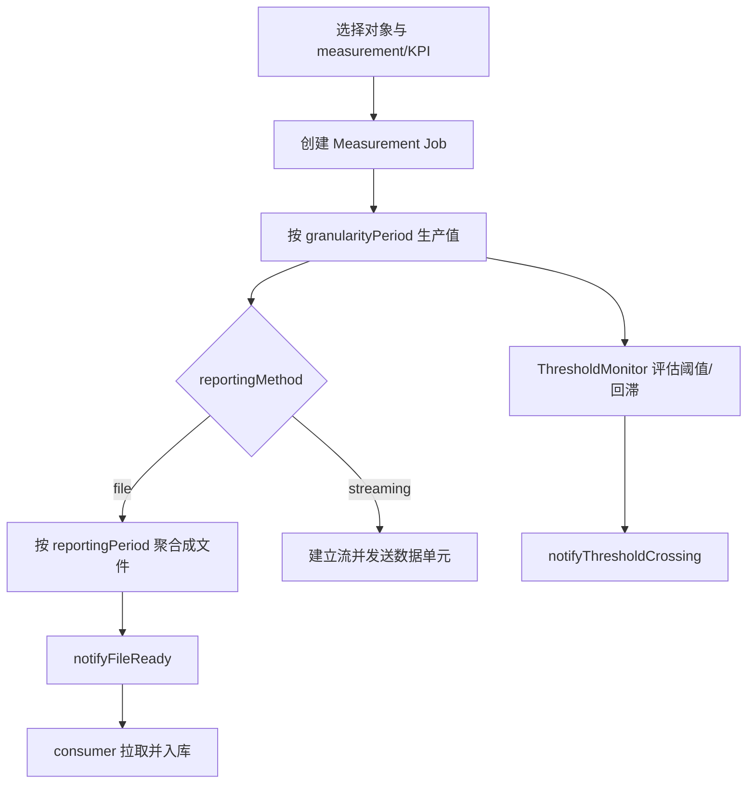

# TS 28.550 学习产出：性能保障

> 规范：3GPP TS 28.550 V18.6.0，*Management and orchestration; Performance assurance*。官方原文与 OpenAPI：[28550-i60.zip](https://www.3gpp.org/ftp/Specs/archive/28_series/28.550/28550-i60.zip)。

## 1. 一句话定位

28.550 定义性能保障的概念、用例、要求、操作和服务组成：**创建什么测量任务、测哪些对象和指标、以什么周期生产、通过文件还是流上报、如何做阈值监控**。

具体测量项主要在 TS 28.552，KPI 定义主要在 TS 28.554；28.550 负责把它们组织成可消费的管理业务。

## 2. 三条性能数据链路



三条链路不是互斥的业务概念：测量生产是基础，文件/流决定数据交付方式，阈值监控针对正在产生的性能指标进行判断。

## 3. Measurement Job 核心字段

| 字段 | 含义 | 学习重点 |
|---|---|---|
| `iOCName` | 被测对象类，如某个 5G NRM IOC | 一个作业指定一个对象类 |
| `iOCInstanceList` | 被测实例 DN 列表 | 空列表可表示 producer 已知的该类全部实例，并可能包括后来新增实例 |
| `measurementCategoryList` | 测量类型名或 KPI 名列表 | 测量来自 28.552，KPI 来自 28.554 |
| `reportingMethod` | `file` 或 `streaming` | 流式支持可选，数据量通常更小、周期更短 |
| `granularityPeriod` | 相邻两次测量值生成间隔 | 它是“生产周期” |
| `reportingPeriod` | 相邻两次文件/报告产生间隔 | 文件方式适用；应为 granularityPeriod 的整数倍 |
| `startTime`/`stopTime` | 作业生效时间窗 | 默认可立即开始、无限期运行 |
| `schedule` | 日/周更细粒度的活跃时段 | 与 start/stop 的总时间窗叠加 |
| `streamTarget` | 流式数据目的端 | 仅 streaming 适用 |
| `priority` | Low/Medium/High | 默认 Medium |
| `reliability` | 作业可靠性要求 | 取值由实现定义 |

创建结果包含 `jobId`、`status` 和 `unsupportedList`。状态可能为 Success、Failure、PartialSuccess；best-effort 场景必须检查 `unsupportedList`，不能只看 HTTP 成功。

## 4. REST 操作

服务根：`{MnSRoot}/PerfMeasJobCtrlMnS/{MnSVersion}`。

| HTTP | 资源 | 业务含义 |
|---|---|---|
| `POST` | `/measJobs` | 创建测量任务 |
| `GET` | `/measJobs` | 查询任务集合 |
| `GET` | `/measJobs/{jobId}` | 查询单个任务 |
| `DELETE` | `/measJobs/{jobId}` | 停止/删除单个任务 |

OpenAPI 请求/资源字段与上一节一致，`reportingMethod` 枚举为 `file`、`streaming`。

## 5. 对象层级与任务分解

| 目标层级 | 作业可能怎样实现 | 输出对象 |
|---|---|---|
| NF | producer 直接让指定 NF 采集 | NF 性能数据 |
| Network/SubNetwork | 将网络级指标分解到组成 NF，复用或创建下层作业，再聚合 | 网络/子网性能数据 |
| NSSI | 对组成 NF/NSSI 的测量进行采集与汇聚 | NSSI 性能数据 |
| NSI | 对组成 NSSI 的测量/KPI 汇聚 | NSI 性能数据 |

终止上层作业时，下层作业不一定删除：如果仍被其他消费者或上层任务使用，producer 可以保留。

## 6. 文件、流与阈值的对象/接口表

| 能力 | 控制对象/接口 | 关键结果 |
|---|---|---|
| 测量任务控制 | `POST/GET/DELETE /measJobs` 或 28.622 `PerfMetricJob` | `jobId`、支持/不支持清单、任务配置 |
| 文件报告 | 28.532 `notifyFileReady`、`notifyFilePreparationError`、`listAvailableFiles` | 文件 URI、格式、大小、就绪/过期时间 |
| 流式报告 | 28.532 streaming data reporting MnS | connection/stream ID、序列化格式、数据单元 |
| 阈值监控 | 28.622 `ThresholdMonitor` + 28.532 CRUD | 指标、阈值、方向、回滞、监控粒度、范围 |
| 阈值通知 | 28.532 `notifyThresholdCrossing` | 实测值、阈值、方向、回滞、粒度 |

## 7. 阈值与回滞

回滞用于避免指标在阈值附近抖动导致通知风暴。以“指标上升为坏”为例：

- 若无回滞，达到/跨过 `thresholdValue` 即触发。
- 若有回滞，可理解为在阈值周围形成不同的进入/退出边界；进入越限与恢复不使用同一条线。
- `monitorGranularityPeriod` 必须与实际产生该指标的测量周期组合相容，否则 producer 可拒绝创建监控。

对于累计计数器与非累计指标，越限触发规则并不完全相同；深入时看 28.550 Annex F。

## 8. 端到端案例：两个小区的 15 分钟性能文件

### 创建任务（示意）

```http
POST /3GPPManagement/PerfMeasJobCtrlMnS/18.1.0/measJobs
Content-Type: application/json

{
  "iOCName": "NrCellDu",
  "iOCInstanceList": [
    "/SubNetwork=OperatorA/ManagedElement=gNB-001/GnbDuFunction=1/NrCellDu=cell-01",
    "/SubNetwork=OperatorA/ManagedElement=gNB-001/GnbDuFunction=1/NrCellDu=cell-02"
  ],
  "measurementCategoryList": [
    "<28.552 中的目标测量类型名>"
  ],
  "reportingMethod": "file",
  "granularityPeriod": 900,
  "reportingPeriod": 3600,
  "priority": "Medium"
}
```

> 周期单位、测量类型合法名称及具体 URI 以实际 OpenAPI 和 28.552 定义为准；示例重点是字段关系。

### 预期流程

1. consumer 预先订阅该范围的文件就绪/准备失败通知。
2. producer 创建作业，返回 `jobId` 和 `unsupportedList`。
3. 每 15 分钟产生一次测量值，每 1 小时形成包含 4 个粒度周期的文件。
4. producer 发送 `notifyFileReady`；consumer 在过期时间前用 HTTPS/SFTP/FTPES 拉取。
5. consumer 检查文件大小、格式、时间窗口、对象 DN、测量类型和重复记录后入库。
6. 同时创建阈值监控：若利用率越过阈值，立即走通知链路，不必等待小时文件。

### 异常处理

- `PartialSuccess`：逐项检查 `unsupportedList`，记录对象/指标/原因。
- 粒度冲突：同一对象同一指标已由不同粒度任务采集时，新请求可能被拒绝。
- 高负载：可能因 CPU、磁盘、内存或最大任务数达到上限失败。
- 文件通知丢失：用 `listAvailableFiles` 或 28.622 `Files/File` 资源轮询补偿。
- 重复通知/下载：以 `jobId + fileLocation + 时间窗口` 做幂等去重。

## 9. 学习验收

- 能准确区分 granularityPeriod 和 reportingPeriod。
- 能解释为什么网络级任务会分解为 NF 级任务，以及终止时为何不能盲删共享下层任务。
- 能给出文件、流、阈值三种交付/响应方式的适用场景。
- 能处理 PartialSuccess、粒度冲突、文件过期和通知丢失。
