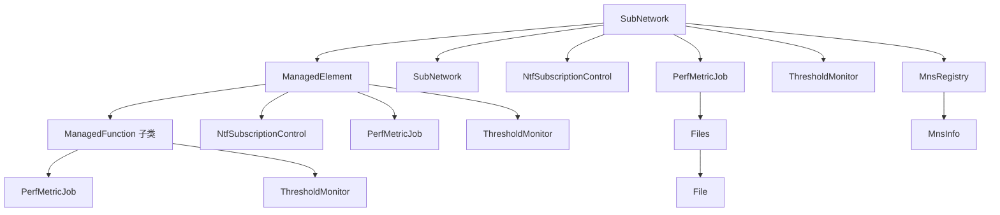
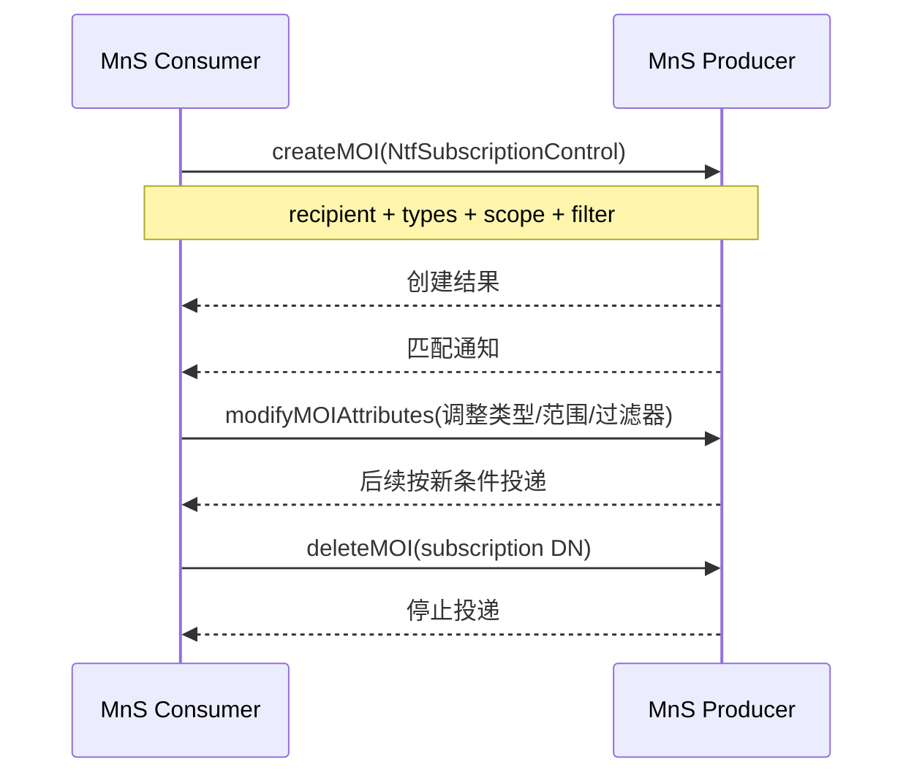

# TS 28.622 学习产出：通用 NRM 信息模型

> 规范：3GPP TS 28.622 V18.13.0，*Generic Network Resource Model (NRM) IRP; Information Service (IS)*。官方原文：[28622-id0.zip](https://www.3gpp.org/ftp/Specs/archive/28_series/28.622/28622-id0.zip)。

## 1. 一句话定位

28.622 定义可被不同业务复用的 Stage 2 对象骨架：`SubNetwork`、`ManagedElement`、`ManagedFunction`、通知订阅、性能任务、阈值监控、文件、MnS 注册发现等。配置管理会操作这些对象，但具体 5G RAN/5GC/切片对象仍要看 28.541。

## 2. 通用对象树



这些是信息模型上的允许关系示意；具体 NRM 子类还会增加自己的包含和引用约束。

## 3. 通用资源对象表

| 对象 | 定义/用途 | 关键属性 |
|---|---|---|
| `SubNetwork` | 一组受管实体；多个 ManagedElement 或 ManagementNode 存在时作为上层容器 | `setOfMcc`、`priorityLabel`、支持的性能指标组/跟踪指标 |
| `ManagedElement` | 表示电信设备或 TMN 实体；可代表专用硬件或虚拟化场景中的受管 NE | `vendorName`、`userDefinedState`、`swVersion`、`priorityLabel`、支持的性能指标组 |
| `ManagedFunction` | 供具体功能 IOC 继承，如 gNB/AMF/SMF/UPF 功能 | `vnfParametersList`、`peeParametersList`、`priorityLabel`、支持的性能指标组 |
| `Top`/`TopX` | 通用继承根，提供统一对象属性语义 | 命名、公共属性与约束由继承链给出 |
| `ManagedEntity` | 供管理服务映射对象访问的代理类概念 | 对象类、对象实例和属性集合 |

`ManagedElement` 可以包含一个或多个 `ManagedFunction`。例如非拆分 gNB 可由一个 ManagedElement 下面的多个功能对象共同表达。

## 4. 通知订阅对象

`NtfSubscriptionControl` 表示一个通知订阅，可由 `SubNetwork` 或 `ManagedElement` 包含。

| 字段 | 必选性 | 含义 |
|---|---|---|
| `notificationRecipientAddress` | M | 通知接收端地址 |
| `notificationTypes` | O | 候选通知类型；缺省时表示所有支持类型 |
| `scope` | O | 以包含该订阅对象的对象为 base，选择受管数据节点范围 |
| `notificationFilter` | O | 对候选通知的参数进行过滤 |

如果 `scope` 缺省，包含 subscription 的 base object 及其下级对象都在范围内。scope 可以包含尚未创建的对象，因此后来新增、符合范围的对象也会自动纳入订阅。

### 订阅业务流程



## 5. 性能任务与阈值对象

### `PerfMetricJob`

| 字段 | 必选性 | 含义 |
|---|---|---|
| `administrativeState` | M | consumer 对任务的期望控制状态 |
| `operationalState` | M | producer 的实际运行状态 |
| `jobId` | M | 关联多任务/上报数据的标识 |
| `performanceMetrics` | M | 要生产的性能指标 |
| `granularityPeriod` | M | 指标生产粒度 |
| `objectInstances`/`rootObjectInstances` | O | 限制具体对象或子树范围 |
| `reportingCtrl` | M | 文件（producer/consumer 选位置）或流式上报控制 |
| `_linkToFiles` | 条件可选 | 指向与作业关联的 `Files` 集合 |
| `schedulerRef`/`conditionMonitorRef` | 选择性 | 用时间或条件控制任务何时活跃 |

### `ThresholdMonitor`

| 字段 | 必选性 | 含义 |
|---|---|---|
| `administrativeState` | M | 启停监控的期望状态 |
| `operationalState` | M | 实际是否可运行 |
| `thresholdInfoList` | M | 多指标/多门限的阈值、方向、回滞等 |
| `monitorGranularityPeriod` | M | 阈值判断粒度 |
| `objectInstances`/`rootObjectInstances` | O | 限定监控范围 |

创建 `ThresholdMonitor` 时，如果指标、粒度或组合不受支持，producer 应拒绝；相关指标没有被性能任务生产时也可能失败。

## 6. 文件检索模型

| 对象/字段 | 含义 |
|---|---|
| `Files` | 相关文件集合；可由 SubNetwork、ManagedElement、PerfMetricJob、TraceJob 包含 |
| `Files.numberOfFiles` | 集合中的文件数 |
| `Files.jobRef`/`jobId` | 集合与数据采集任务的关联 |
| `File.fileLocation` 或 `fileContent` | 通过协议拉取，或通过 CM read 直接取内容；二者择一 |
| `File.fileCompression`、`fileSize`、`fileDataType`、`fileFormat` | 文件属性 |
| `File.fileReadyTime`、`fileExpirationTime` | 就绪与保存时限 |
| `File.jobRef`/`jobId` | 单个文件与任务的关联 |

允许的外部文件传输协议为 SFTP、FTPES、HTTPS。File 实例在文件可供 consumer 获取时创建，并至少保留到 `fileExpirationTime`。

`_linkToFiles` 很重要：consumer 可以直接为某作业对应的 Files 子树创建窄范围订阅，也可以在通知丢失时轮询这一集合。

## 7. MnS 发现对象

| 对象 | 作用 | 关键字段 |
|---|---|---|
| `MnsRegistry` | `MnsInfo` 的容器，每个 SubNetwork 至多一个 | 无专用业务字段 |
| `MnsInfo` | 描述一个可用 MnS，支持 consumer 发现 producer 和地址 | `mnsLabel`、`mnsType`、`mnsVersion`、`mnsAddress`、`mnsScope` |

这建立了“先发现某类 MnS 的版本、地址、管理范围，再调用具体服务”的模型基础。

## 8. 端到端案例：配置变更订阅 + 文件补偿

### 场景

运维系统要监控 `ManagedElement=gNB-001` 下所有 5G 资源的配置变化，同时收取某性能任务生成的文件。

### 步骤

1. 在该 ManagedElement 下创建 `NtfSubscriptionControl=cm-sub-01`：
   - `notificationRecipientAddress` 指向运维系统回调；
   - `notificationTypes` 选择创建、删除、属性变化/批量变化；
   - `scope` 覆盖 base object 全子树；
   - `notificationFilter` 排除不关心的属性。
2. 通过 28.532 修改一个 `NrCellDu`；consumer 收到通知，用 notificationId 去重，再按需要 GET 回读完整对象。
3. 创建 `PerfMetricJob` 并取得 `_linkToFiles`。
4. 对该 `Files` 集合下一级 `File` 对象创建窄范围通知订阅。
5. File 创建后，consumer 收到 `notifyFileReady` 或通用 MOI creation 通知，读取文件元数据并拉取。
6. 若通知链路中断，consumer GET `_linkToFiles` 指向的集合，按 `fileReadyTime` 与已处理清单补齐缺失文件。
7. 任务结束后删除性能作业和订阅，检查 Files/File 的保留策略，避免资源泄漏。

### 验收点

- DN 可唯一定位订阅、任务、文件集合和具体文件。
- scope 不越过租户/运维域授权边界。
- 通知处理幂等，回调失败有重试和快照补偿。
- 使用 `administrativeState` 控制期望，用 `operationalState` 判断实际能力。
- 文件在 `fileExpirationTime` 前拉取，并校验大小、格式、时间窗。

## 9. 与 Stage 3 的边界

28.622 主要是 Stage 2 信息模型。落地 REST/JSON 时还会用到 TS 28.623 的通用 NRM Solution Set，以及 TS 32.158 的公共 REST 映射规则；5G 具体对象的 Stage 2/3 定义则看 28.541。学习时建议采用：

```text
28.622 通用骨架 → 28.541 具体 5G 对象 → 28.532 通用服务 → 28.623/32.158 公共 Stage 3 细节
```

## 10. 学习验收

- 能画出 SubNetwork → ManagedElement → ManagedFunction 的基本层次。
- 能解释订阅的 recipient、types、scope、filter 四个控制面。
- 能说清 PerfMetricJob、ThresholdMonitor、Files/File 如何协作。
- 能指出 28.622 不是“全部 5G 配置对象模型”，以及后续应查哪份规范。
